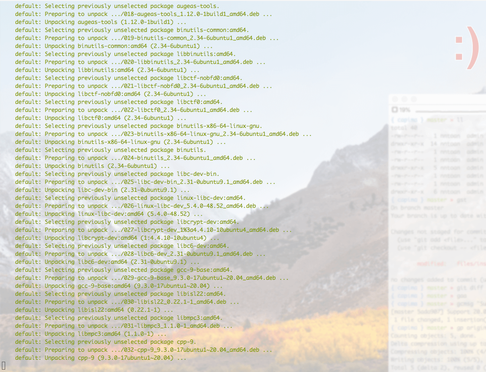
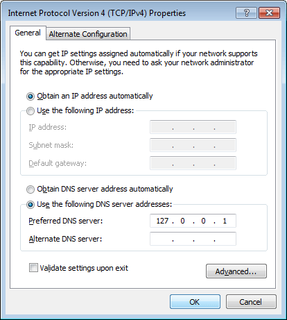

## Setup Capima with Vagrant

This repository provides a better way to install Vagrant w/ Capima. After following the installation instructions, you'll have a server managed by Capima. For the more detail what is Capima, [click here](https://capima.nntoan.com).

## Information
You will be able to setup as many domain as you want. And a better, faster stack for developing any framework, applications.

## Getting Started
1. Install dependencies
  * [Virtualbox](https://www.virtualbox.org/) 5.0 or greater.
  * [Vagrant](http://downloads.vagrantup.com/) 1.8.3 or greater.
  * [Plugin: Disksize](https://github.com/sprotheroe/vagrant-disksize)
2. Clone this [repository](https://github.com/nntoan/capima-box)
3. Change the settings in [settings.yml](https://github.com/nntoan/capima-box/blob/master/settings.yml) to fit your needs.
```bash
$ cp settings.yml.sample settings.yml
```
4. Execute the following commands to setup the virtual machine: (check [this](https://github.com/nntoan/vagrant-capima#connecting-to-capima) before execute commands below)
```bash
$ vagrant up
$ vagrant ssh
```
5. Take a coffee and wait for it ☕





# Extra Configuration
The following configuration are not required, but could be useful some day.

### Dnsmasq (Linux/macOS)
[Dnsmasq](http://www.thekelleys.org.uk/dnsmasq/doc.html) is a very well-known package in *nix world (Mac OS X is Unix, Ubuntu is Linux).
It provides network infrastructure for small networks such as DNS, DHCP, router advertisement and network boot.
If you need to point a domain to a specified IP address like *.test*, *.dev*, *.xxx* to *127.0.0.1* or your `<private-ip>`, you will need Dnsmasq!
  * **Ubuntu tutorials**
    * http://manpages.ubuntu.com/manpages/xenial/man8/dnsmasq.8.html
    * https://gist.github.com/magnetikonline/6236150
  * **Mac OS X tutorials**
    * https://passingcuriosity.com/2013/dnsmasq-dev-osx/
    * https://gist.github.com/ogrrd/5831371


### Acrylic DNS (Windows folks)
Are you tired by changing your hosts file all the time? Do you want to config your hosts file once and never touch it again?
Then ladies and gentlemen, I present to you: [Acrylic DNS - an alternative Dnsmasq for Windows](http://mayakron.altervista.org/wikibase/show.php?id=AcrylicHome).
  * **Windows instructions**
    * Download & install the package you find in the link above for your Windows 7/8/10
    * In your [Acrylic config file](http://mayakron.altervista.org/wikibase/show.php?id=AcrylicConfiguration) :
      * Find `PrimaryServerAddress=8.8.8.8` and replace `8.8.8.8` to your primary DNS server you'd like
      * Find `SecondaryServerAddress=8.8.4.4` and replace `8.8.4.4` to your secondary DNS server you'd like
    * In your [Acrylic host file](http://mayakron.altervista.org/wikibase/show.php?id=AcrylicHosts) :
      * Add `<your-private-ip> *.domain` to the end of file (replace *.domain* to whatever you want such as *.local*)
    * Access the properties of your Internet connection, then access the properties of the Internet Protocol Version 4 (TCP/IPv4) item

    * Select the Use the following DNS server addresses option and set the value of the Preferred DNS server field to 127.0.0.1. Then click on the OK button.

    * Purge DNS cache by go to **Start Menu\Acrylic DNS Proxy\Config\Purge Acrylic Cache Data**
    * DONE!

